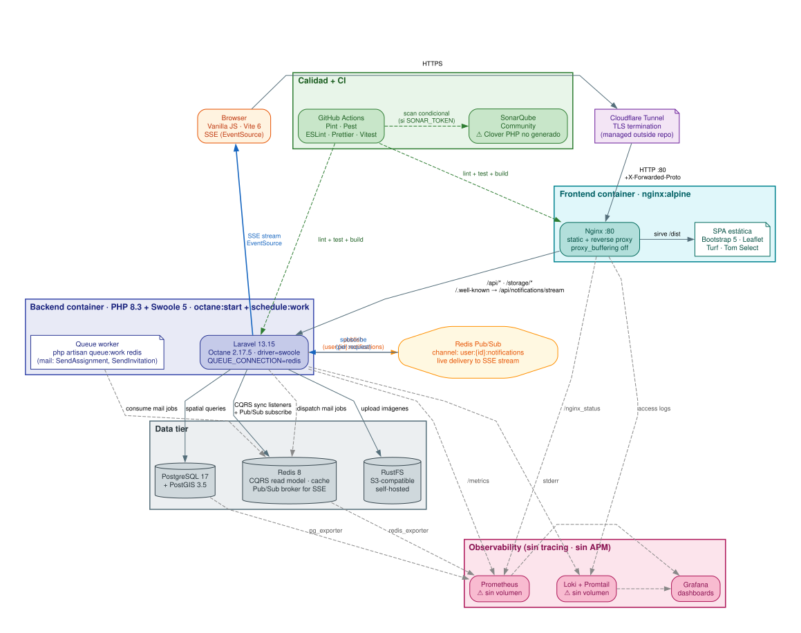

# 🌍 Sistema Web de Gestión de Incidencias Georreferenciadas

> Proyecto integrador de la Carrera de Software — Facultad de Sistemas y Telecomunicaciones, UPSE  
> *Desarrollado con Laravel, Bootstrap, JavaScript, PostgreSQL/Redis y Docker*

---

## 📌 Descripción General

Este proyecto consiste en el desarrollo de una **aplicación web completa** para la gestión de **incidencias georreferenciadas**, que va más allá del simple registro: incluye seguimiento, trazabilidad, asignación de responsables, historial de acciones, comentarios, notificaciones, clasificación jerárquica, métricas y visualización gráfica.

El sistema simula un entorno real de gestión municipal o técnica, donde múltiples actores colaboran en la resolución de incidencias, manteniendo la integridad, trazabilidad y organización de la información geográfica y operativa.

---

## 🏗️ Arquitectura del Sistema



> **Convención visual:** flecha sólida = tráfico real de request · flecha punteada = observabilidad / CI (no transporta tráfico de usuario) · `[(…)]` = datastore · `{{…}}` = hub/puerto · ⚠️ = caveat conocido del estado actual.
>
> **Caveats documentados en el diagrama:** (1) TLS termination ocurre en Cloudflare, Nginx escucha HTTP plano en `:80`; (2) Prometheus y Loki **no tienen volúmenes persistentes** — métricas y logs son efímeros; (3) el coverage report PHP Clover que SonarQube espera **no se genera** con la config actual de phpunit; (4) PHPStan está instalado pero **no corre en CI**.

### 📊 Dominios Principales (Domain-Driven Design)

| Dominio | Responsabilidades | Entidades Clave |
|---------|-------------------|-----------------|
| **Incidents** | CRUD, Estados, Workflow, Georreferenciación | Incident, IncidentCategory, Status, Location |
| **Comments** | Comentarios anidados, Imágenes, Historial | Comment, CommentImage, Thread |
| **Assignments** | Asignación de responsables, Roles | Assignment, AssignmentRole |
| **Users** | Perfiles, Roles, Permisos | User, Role, Permission |
| **Notifications** | Alertas, Marcas leído/no leído | Notification, Event |
| **Auth** | JWT + Firebase, Sesiones | Token, RefreshToken |
| **Menus** | Menús dinámicos, Control de acceso | Menu (role-filtered) |

### 🔄 Flujos Clave

- **Reporte de incidencia** (Ciudadano) → Validación → Almacenamiento → Notificación a Staff
- **Cambio de estado** → Trigger DB → Historial → Event → Notificación → Suscriptores
- **Asignación** → Policy check → Permission validation → Event → Notificación
- **Comentario** → Policy check → Almacenamiento → Notificación en tiempo real (WebSocket)

---

## 🎯 Objetivo

Desarrollar una aplicación web que permita:

- Gestionar incidencias con información básica y georreferenciada.
- Controlar el ciclo de vida completo de cada incidencia (estados, historial, responsables).
- Integrar frontend, backend, base de datos y despliegue en contenedores.
- Aplicar arquitectura basada en servicios y buenas prácticas de desarrollo.

---

## 🧩 Alcance del Sistema

El sistema debe permitir:

### 1. Gestión de Incidencias
- Registro con información básica (título, descripción, ubicación, tipo, prioridad, etc.)
- Edición y eliminación de incidencias.

### 2. Gestión de Estados
- Flujo de estados: `Pendiente → En proceso → Resuelto`
- Historial completo de cambios de estado con fecha y usuario responsable.

### 3. Asignación de Responsables
- Asignar uno o varios usuarios a una incidencia.
- Definir roles: `responsable`, `apoyo`.

### 4. Sistema de Comentarios / Seguimiento
- Agregar comentarios a cada incidencia.
- Registro de autor y fecha de cada comentario.

### 5. Ubicación Normalizada
- Datos de ubicación almacenados en tablas relacionadas:
  - País
  - Provincia
  - Ciudad

### 6. Clasificación Jerárquica
- Tipo de incidencia → Subtipo
  - Ejemplo: `Infraestructura → Alumbrado`
  - Ejemplo: `Seguridad → Robo`

### 7. Notificaciones del Sistema
- Notificaciones por cambios de estado.
- Estado leído/no leído de notificaciones.

### 8. Prioridad y Control
- Prioridad: alta, media, baja.
- Fecha de creación y tiempo de resolución.

### 9. Consultas con Filtros, Agrupaciones y Métricas
- Incidencias por estado, tipo, ubicación.
- Tiempo promedio de resolución.
- Visualización mediante tablas o componentes gráficos simples (dashboard).

### Despliegue
- Ejecución de la aplicación en contenedores.
- Configuración de un entorno que incluya: aplicación backend y base de datos.

---

## 👥 Organización del Trabajo

- El proyecto se desarrolla en **equipos de 3 estudiantes**.
- Cada integrante asume responsabilidad principal en uno de estos componentes:
  1. **Frontend**: interfaz y visualización (Bootstrap + JavaScript fetch)
  2. **Backend**: servicios y lógica del sistema (Laravel API REST)
  3. **Infraestructura**: diseño de base de datos y despliegue (MySQL + Docker)

> ⚠️ Todos los integrantes deben comprender e integrar el funcionamiento completo del sistema.

---

## 🛠️ Tecnologías y Lineamientos de Desarrollo

| Componente       | Tecnología                                          |
|------------------|-----------------------------------------------------|
| Backend          | Laravel (API REST)                                  |
| Frontend         | HTML, CSS, Bootstrap                                |
| Cliente          | JavaScript (fetch)                                  |
| Base de datos    | MySQL, PostgreSQL o motores relacionales equivalentes |
| Despliegue       | Contenedores (Docker)                               |

### Requisitos Técnicos

- La aplicación debe ser **completa e integrada**.
- Mantener **consistencia en el diseño de la interfaz**.
- Usar **buenas prácticas en la organización del código** (naming, separación de responsabilidades, comentarios, etc.).

---

## 🔍 Requerimientos de Calidad del Software

Como parte de la integración con la asignatura de Calidad de Software, el proyecto debe incorporar prácticas básicas de validación y aseguramiento de calidad:

- Validaciones y manejo de errores tanto en frontend como en backend.
- Diseño y ejecución de casos de prueba funcionales sobre los principales módulos del sistema.
- Evidencias de testing realizadas durante el desarrollo.
- Uso básico de métricas o indicadores relacionados con el funcionamiento del sistema.
- Prueba básica de carga o estrés sobre funcionalidades principales.
- Uso de herramientas de apoyo para validación, pruebas o análisis de calidad.

> Las evidencias deben incorporarse tanto en el documento técnico como en la demostración funcional del sistema.

---

## ✅ Criterios Adicionales (Valoración Extra)

Se otorgará hasta **5 puntos adicionales** por implementar funcionalidades avanzadas no obligatorias, como:

- Despliegue con múltiples instancias de la aplicación (escalamiento básico).
- Implementación de configuraciones adicionales en contenedores.
- Optimización del sistema más allá de los requerimientos mínimos.

> Estas mejoras deben ser funcionales y debidamente justificadas en el documento técnico.

---

## 📤 Modalidad de Entrega

El proyecto podrá desplegarse en servidores de la carrera, permitiendo acceso mediante URL para evaluación.

### Entregables Obligatorios:

1. Código fuente del sistema.
2. Archivo de base de datos (SQL).
3. Documento técnico del proyecto (8–12 páginas máximo).
4. Enlaces URLs para evidenciar funcionalidad completa del proyecto.

---

## 📄 Documento Técnico del Proyecto

Debe evidenciar implementación, decisiones y resultados obtenidos. No debe copiar teoría.

### Estructura Recomendada:

#### Portada
- Nombre del proyecto
- Nombre de la carrera
- Asignaturas involucradas
- Integrantes del equipo
- Docentes
- Fecha

#### 1. Descripción de la Implementación
- Breve explicación de cómo lo implementaron y decisiones tomadas.

#### 2. Arquitectura del Sistema y Tecnologías Utilizadas
- Descripción general de frontend, backend, base de datos, contenedores.
- Diagrama o esquema de relaciones (sin código).

#### 3. Funcionalidades Implementadas
- Qué se implementó y qué no (y por qué).

#### 4. Base de Datos
- Imagen legible del modelo lógico y físico ER.
- Archivo SQL adjunto.

#### 5. Credenciales de Acceso
- Usuario administrador
- Usuario normal
- Contraseñas

#### 6. Instrucciones de Ejecución
- Cómo iniciar el proyecto.
- Cómo conectar la base de datos.
- Cómo acceder al sistema.

#### 7. Despliegue
- Uso de contenedores.
- Entorno donde se ejecuta.
- URL del sistema (para verificar funcionalidad).

#### 8. Evidencias de Implementación y Calidad del Sistema

**Capturas del sistema:**
- Pantalla principal del sistema.
- Registro y gestión de incidencias.
- Listados y consultas.
- Dashboard, reportes o componentes de visualización.

**Evidencias de calidad:**
- Validaciones implementadas.
- Evidencias de pruebas funcionales realizadas.
- Resultados básicos de testing o pruebas de carga.

**Evidencias adicionales:**
- Capturas, resultados de pruebas, tablas, métricas y registros técnicos como **anexos** del documento.

#### 9. Dificultades y Soluciones
- Problemas encontrados y cómo los resolvieron.

#### 10. Conclusiones
- Qué aprendieron.
- Cómo integraron las materias.

---

## 📊 Rúbrica Aplicada

### Tecnologías y Desarrollo Web (40%)

| Criterio                     | Descripción                                                                                      | Puntaje |
|------------------------------|--------------------------------------------------------------------------------------------------|---------|
| Interfaz de usuario          | Diseño claro, organizado y funcional utilizando Bootstrap                                        | 6       |
| Integración frontend-backend | Consumo correcto de servicios web (fetch), envío, recepción y visualización de datos             | 6       |
| Funcionalidad del sistema    | Implementación del CRUD y funcionalidades adicionales (comentarios, asignación, seguimiento)     | 6       |
| Lógica del sistema           | Manejo de estados, roles, flujo funcional y trazabilidad de incidencias                          | 5       |
| Visualización y experiencia  | Conteos, filtros y visualización organizada de información relevante                             | 4       |
| Organización del código      | Estructura clara, orden y buenas prácticas                                                       | 4       |
| Documento técnico            | Claridad, coherencia y evidencia de decisiones de implementación                                 | 4       |
| Demostración del sistema     | Explicación clara del flujo completo del sistema y participación del equipo                      | 5       |
| **Total**                    |                                                                                                  | **40**  |

### Calidad de Software (20%)

| Criterio                      | Descripción                                                                  | Puntaje |
|-------------------------------|------------------------------------------------------------------------------|---------|
| Validaciones del sistema      | Implementación de validaciones y manejo de errores en frontend y backend     | 4       |
| Casos de prueba funcionales   | Diseño y ejecución de pruebas sobre funcionalidades principales              | 4       |
| Evidencias de testing         | Presentación de capturas, resultados o registros de pruebas realizadas       | 4       |
| Pruebas de carga o estrés     | Ejecución básica de pruebas sobre funcionalidades relevantes                 | 3       |
| Uso de herramientas de calidad | Uso de herramientas de validación, testing o análisis del sistema           | 3       |
| Métricas e indicadores        | Presentación de métricas relacionadas con pruebas, errores o funcionamiento  | 2       |
| **Total**                     |                                                                              | **20**  |

### Administración de Data Center (20%)

| Criterio                    | Descripción                                                                              | Puntaje |
|-----------------------------|------------------------------------------------------------------------------------------|---------|
| Uso de contenedores         | Implementación del sistema utilizando contenedores (backend y base de datos)             | 8       |
| Configuración del entorno   | Ejecución correcta del sistema, configuración funcional y persistencia de datos          | 5       |
| Integración de servicios    | Comunicación adecuada entre los componentes (backend, base de datos, red)                | 4       |
| Organización del despliegue | Estructura clara del entorno, archivos de configuración organizados y comprensibles      | 3       |
| **Total**                   |                                                                                          | **20**  |

### Base de Datos I y II (20%)

| Criterio                      | Descripción                                                                                        | Puntaje |
|-------------------------------|----------------------------------------------------------------------------------------------------|---------|
| Modelo de datos               | Diseño adecuado de entidades, relaciones y estructura del sistema                                  | 5       |
| Normalización e integridad    | Aplicación adecuada de normalización, claves y reglas de integridad                               | 4       |
| Implementación de la BD       | Creación correcta de tablas, relaciones y consistencia de datos                                    | 3       |
| Consultas y análisis de datos | Consultas con filtros, agrupaciones, métricas y análisis de información                            | 3       |
| Programación SQL              | Uso de procedimientos almacenados, vistas, triggers, funciones o componentes SQL avanzados         | 5       |
| **Total**                     |                                                                                                    | **20**  |

---

## 🎤 Condiciones de la Demostración

- **Tiempo máximo**: 10 minutos por grupo.
- **Debe incluir**:
  - Explicación general del sistema.
  - Demostración funcional.
  - Participación de todos los integrantes.

> La demostración será evaluada únicamente por la asignatura de Tecnologías y Desarrollo Web y equivale al examen final de la materia.

---

## 🗓️ Socialización del Proyecto

- **Fecha**: 04 de mayo de 2026
- **Modalidad**: Sesión en clase para presentar el alcance del proyecto, resolver dudas y orientar el desarrollo por equipos.

---

## 📁 Estructura Recomendada del Repositorio

```
/incidencias-georreferenciadas
├── /backend          # Laravel API REST
├── /frontend         # HTML, CSS, Bootstrap, JS
├── /database         # Scripts SQL, modelos ER
├── /docker           # Dockerfiles, docker-compose.yml
├── /docs             # Documento técnico (PDF o Markdown)
├── README.md         # Este archivo
└── .gitignore
```

---

## 🚀 Cómo Ejecutar el Proyecto (Ejemplo)

```bash
# Clonar el repositorio
git clone https://github.com/tu-usuario/incidencias-georreferenciadas.git
cd incidencias-georreferenciadas

# Levantar contenedores
docker-compose up -d

# Acceder al sistema
# Frontend: http://localhost:3000
# Backend: http://localhost:8000/api
# Base de datos: localhost:3306
```

> Las credenciales exactas estarán en el documento técnico.

---

## 📞 Contacto

Facultad de Sistemas y Telecomunicaciones  
Universidad Especializada de las Américas (UPSE)  
Campus matriz, La Libertad - Santa Elena - ECUADOR  
📞 (04) 781 - 732 | 🌐 www.upse.edu.ec

---

## 📝 Notas Finales

- Este proyecto es una oportunidad para integrar conocimientos de desarrollo web, bases de datos y administración de infraestructuras.
- Prioriza la calidad, la trazabilidad y la experiencia de usuario.
- ¡Buena suerte y buen código!
