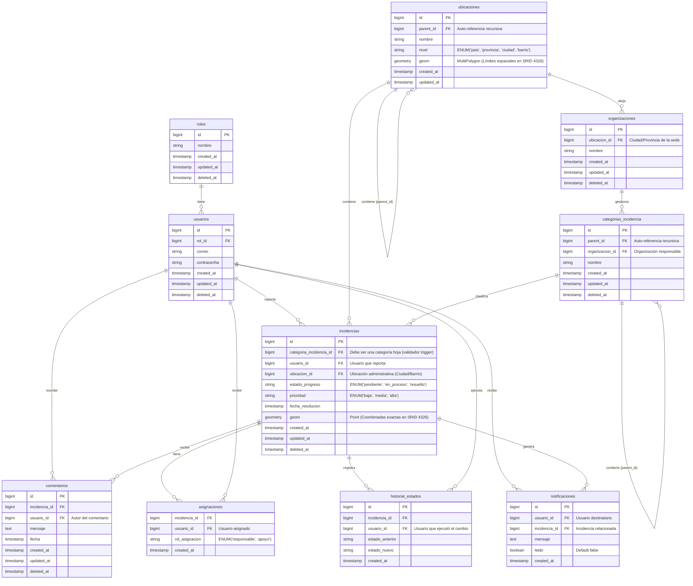

# Diagrama Entidad-Relación (DER) Corregido v3

Este archivo contiene el diseño relacional de la base de datos para el **Sistema de Incidencias Georreferenciadas**, incorporando la unificación de categorías recursivas y el diseño de restricciones a nivel base de datos.



## Propuesta de Programación SQL Avanzada (Rúbrica de BD)

Aquí definimos formalmente las funciones y disparadores (Triggers) para cumplir con el 20% de la nota de Base de Datos.

### 1. Trigger de Validación de Categoría Hoja (Leaf Node Constraint)
Este trigger impide crear o actualizar una incidencia apuntando a una categoría general (padre). La incidencia solo se puede registrar si la categoría seleccionada no posee subcategorías asociadas.

```sql
CREATE OR REPLACE FUNCTION check_is_leaf_category()
RETURNS TRIGGER AS $$
BEGIN
    -- Comprobar si existen registros en categorias_incidencia que tengan como padre al ID seleccionado
    IF EXISTS (
        SELECT 1 
        FROM categorias_incidencia 
        WHERE parent_id = NEW.categoria_incidencia_id
    ) THEN
        RAISE EXCEPTION 'No se puede asociar una incidencia a una categoría padre (debe ser una categoría hoja sin subcategorías). ID: %', NEW.categoria_incidencia_id;
    END IF;
    RETURN NEW;
END;
$$ LANGUAGE plpgsql;

CREATE TRIGGER trg_validar_categoria_hoja
BEFORE INSERT OR UPDATE ON incidencias
FOR EACH ROW
EXECUTE FUNCTION check_is_leaf_category();
```

### 2. Trigger de Historial de Estados Automático
Registra de forma transparente la trazabilidad en `historial_estados` cada vez que se actualiza el estado de una incidencia.

```sql
CREATE OR REPLACE FUNCTION log_estado_incidencia()
RETURNS TRIGGER AS $$
BEGIN
    IF OLD.estado_progreso IS DISTINCT FROM NEW.estado_progreso THEN
        INSERT INTO historial_estados (incidencia_id, usuario_id, estado_anterior, estado_nuevo, created_at)
        VALUES (
            NEW.id,
            -- Nota: En un entorno real, el ID del usuario se pasaría mediante una variable de sesión de la BD
            -- o se recuperaría según el contexto de la transacción.
            COALESCE(NEW.usuario_id, OLD.usuario_id), 
            OLD.estado_progreso,
            NEW.estado_progreso,
            NOW()
        );
    END IF;
    RETURN NEW;
END;
$$ LANGUAGE plpgsql;

CREATE TRIGGER trg_log_estado_incidencia
AFTER UPDATE ON incidencias
FOR EACH ROW
EXECUTE FUNCTION log_estado_incidencia();
```

### 3. Trigger de Geolocalización Administrativa Automática (PostGIS)
Asigna automáticamente la ubicación administrativa (`ubicacion_id`) en base al punto geográfico (`geom` de tipo Point) y los polígonos de las ubicaciones (`geom` de tipo MultiPolygon) mediante intersección espacial.

```sql
CREATE OR REPLACE FUNCTION auto_assign_ubicacion()
RETURNS TRIGGER AS $$
DECLARE
    v_ubicacion_id BIGINT;
BEGIN
    -- Busca la ubicación de menor nivel (ej. Ciudad o Barrio) donde cae el punto geográfico
    SELECT id INTO v_ubicacion_id
    FROM ubicaciones
    WHERE ST_Contains(geom, NEW.geom)
    ORDER BY CASE 
        WHEN nivel = 'barrio' THEN 1
        WHEN nivel = 'ciudad' THEN 2
        WHEN nivel = 'provincia' THEN 3
        ELSE 4
    END
    LIMIT 1;

    IF v_ubicacion_id IS NOT NULL THEN
        NEW.ubicacion_id := v_ubicacion_id;
    END IF;
    
    RETURN NEW;
END;
$$ LANGUAGE plpgsql;

CREATE TRIGGER trg_auto_assign_ubicacion
BEFORE INSERT OR UPDATE OF geom ON incidencias
FOR EACH ROW
EXECUTE FUNCTION auto_assign_ubicacion();
```
