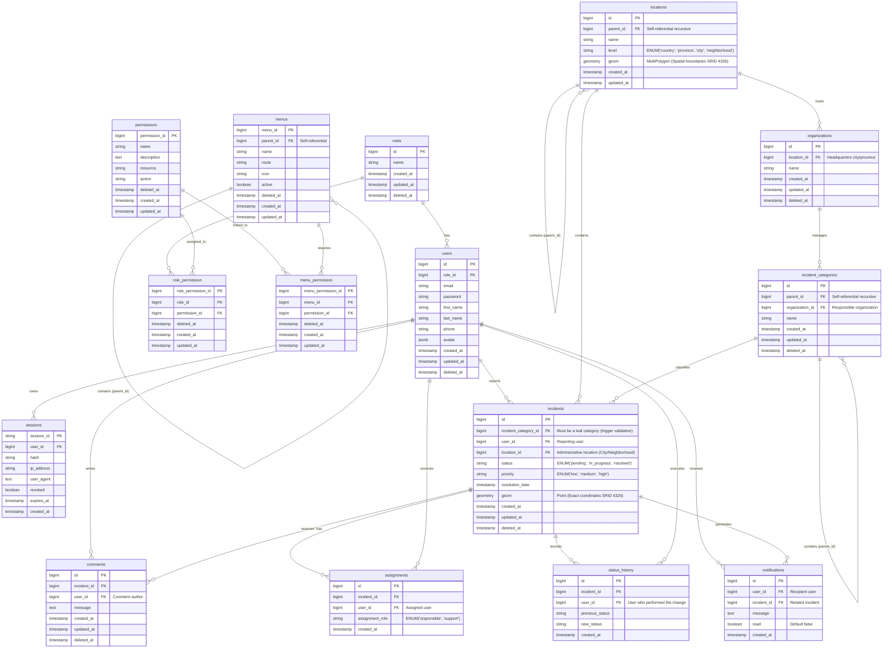

# Entity-Relationship Diagram (ERD) — Georeferenced Incidents System

This file contains the relational database design for the **Georeferenced Incidents Management System**, incorporating RBAC authorization, menu management, spatial data, and database-level constraints.



## SQL Database Constraints (PostgreSQL + PostGIS)

### 1. Leaf Category Validation Trigger
Prevents creating/updating an incident pointing to a parent (non-leaf) category.

```sql
CREATE OR REPLACE FUNCTION check_is_leaf_category()
RETURNS TRIGGER AS $$
BEGIN
    IF EXISTS (
        SELECT 1
        FROM incident_categories
        WHERE parent_id = NEW.incident_category_id
    ) THEN
        RAISE EXCEPTION 'Cannot associate an incident with a parent category (must be a leaf category). ID: %', NEW.incident_category_id;
    END IF;
    RETURN NEW;
END;
$$ LANGUAGE plpgsql;

CREATE TRIGGER trg_validate_leaf_category
BEFORE INSERT OR UPDATE ON incidents
FOR EACH ROW
EXECUTE FUNCTION check_is_leaf_category();
```

### 2. Automatic Status History Trigger
Records traceability in `status_history` whenever an incident's status is updated.

```sql
CREATE OR REPLACE FUNCTION log_incident_status()
RETURNS TRIGGER AS $$
BEGIN
    IF OLD.status IS DISTINCT FROM NEW.status THEN
        INSERT INTO status_history (incident_id, user_id, previous_status, new_status, created_at)
        VALUES (
            NEW.id,
            COALESCE(NEW.user_id, OLD.user_id),
            OLD.status,
            NEW.status,
            NOW()
        );
    END IF;
    RETURN NEW;
END;
$$ LANGUAGE plpgsql;

CREATE TRIGGER trg_log_incident_status
AFTER UPDATE ON incidents
FOR EACH ROW
EXECUTE FUNCTION log_incident_status();
```

### 3. Automatic Administrative Geolocation Trigger (PostGIS)
Automatically assigns the administrative location (`location_id`) based on the geographic point (`geom` Point) and location polygons via spatial intersection.

```sql
CREATE OR REPLACE FUNCTION auto_assign_location()
RETURNS TRIGGER AS $$
DECLARE
    v_location_id BIGINT;
BEGIN
    SELECT id INTO v_location_id
    FROM locations
    WHERE ST_Contains(geom, NEW.geom)
    ORDER BY CASE
        WHEN level = 'neighborhood' THEN 1
        WHEN level = 'city' THEN 2
        WHEN level = 'province' THEN 3
        ELSE 4
    END
    LIMIT 1;

    IF v_location_id IS NOT NULL THEN
        NEW.location_id := v_location_id;
    END IF;

    RETURN NEW;
END;
$$ LANGUAGE plpgsql;

CREATE TRIGGER trg_auto_assign_location
BEFORE INSERT OR UPDATE OF geom ON incidents
FOR EACH ROW
EXECUTE FUNCTION auto_assign_location();
```
